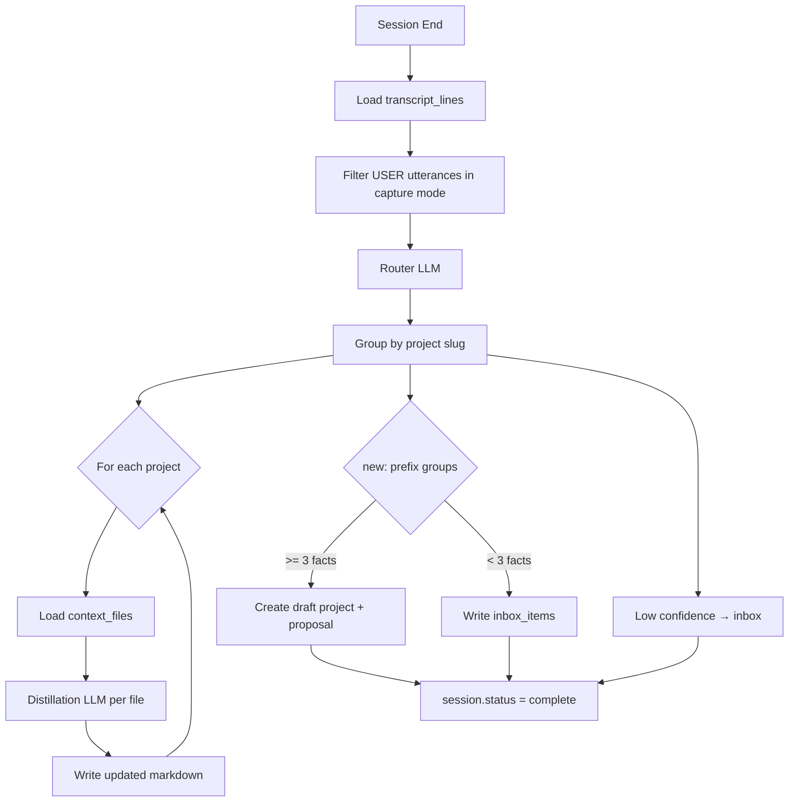
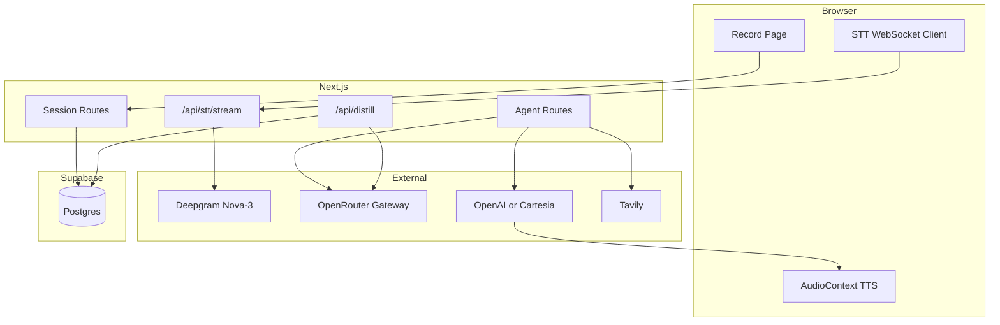

# Hermes Recorder — Implementation Spec

Technical blueprint for building the MVP. Kimi should follow this document alongside the [PRD](./hermes-recorder-prd.md) and [Setup Guide](./setup-and-supabase.md).

---

## 1. Tech Stack

| Layer | Choice | Version Notes |
|-------|--------|---------------|
| Framework | Next.js App Router | 15.x |
| UI | React + TypeScript strict | 19.x |
| Styling | Tailwind CSS + shadcn/ui | Minimal components |
| Auth + DB | Supabase (`@supabase/supabase-js`, `@supabase/ssr`) | Latest |
| STT | Deepgram Nova-3 | WebSocket via server proxy |
| LLM | OpenRouter (OpenAI-compatible API) | Model slugs via env vars |
| TTS | OpenAI or Cartesia | Configurable via env |
| Web Search | Tavily API | Agent tool only |
| Hosting | Vercel | Serverless functions |

**Do not add:** Redis, BullMQ, separate WebSocket server, mobile framework, client-side Deepgram keys, or direct Anthropic API calls (use OpenRouter).

### 1.1 OpenRouter Client

All LLM calls (router, distillation, agent) go through OpenRouter using the OpenAI-compatible chat completions API.

**Install:** `npm install openai` (not `@anthropic-ai/sdk`)

**File:** `lib/openrouter.ts`

```typescript
import OpenAI from 'openai';

export function createOpenRouterClient() {
  return new OpenAI({
    baseURL: 'https://openrouter.ai/api/v1',
    apiKey: process.env.OPENROUTER_API_KEY!,
    defaultHeaders: {
      'HTTP-Referer': process.env.OPENROUTER_HTTP_REFERER ?? process.env.NEXT_PUBLIC_APP_URL ?? '',
      'X-Title': 'Hermes Recorder',
    },
  });
}

export const MODELS = {
  router: process.env.OPENROUTER_MODEL_ROUTER!,
  distillation: process.env.OPENROUTER_MODEL_DISTILLATION!,
  agent: process.env.OPENROUTER_MODEL_AGENT!,
} as const;
```

**Usage pattern:**

```typescript
const client = createOpenRouterClient();
const response = await client.chat.completions.create({
  model: MODELS.router,
  messages: [{ role: 'user', content: prompt }],
  response_format: { type: 'json_object' }, // router only
});
```

**Streaming (agent route):**

```typescript
const stream = await client.chat.completions.create({
  model: MODELS.agent,
  messages,
  tools: [webSearchToolDefinition],
  stream: true,
});
for await (const chunk of stream) {
  // emit SSE text_delta events
}
```

**Env vars required:**

| Variable | Purpose | Example |
|----------|---------|---------|
| `OPENROUTER_API_KEY` | Auth | `sk-or-...` |
| `OPENROUTER_MODEL_ROUTER` | Transcript routing | `anthropic/claude-3.5-haiku` |
| `OPENROUTER_MODEL_DISTILLATION` | Context file distillation | `anthropic/claude-sonnet-4` |
| `OPENROUTER_MODEL_AGENT` | Conversation agent | `anthropic/claude-sonnet-4` |
| `OPENROUTER_HTTP_REFERER` | Optional attribution | `https://your-app.vercel.app` |

Model slugs come from https://openrouter.ai/models — swap anytime without code changes.

---

## 2. Repository Structure

```
hermes-recording/
├── .env.example
├── .env.local                    # gitignored
├── middleware.ts
├── app/
│   ├── layout.tsx
│   ├── page.tsx                  # redirect → /workspaces
│   ├── login/page.tsx
│   ├── workspaces/
│   │   ├── page.tsx
│   │   └── [workspaceId]/
│   │       ├── page.tsx
│   │       └── inbox/page.tsx
│   ├── record/page.tsx
│   ├── context/
│   │   └── [projectId]/
│   │       ├── page.tsx
│   │       └── [slug]/page.tsx
│   ├── proposals/page.tsx
│   ├── session/[id]/page.tsx
│   └── api/
│       ├── session/start/route.ts
│       ├── session/end/route.ts
│       ├── transcript/append/route.ts
│       ├── stt/stream/route.ts
│       ├── agent/message/route.ts
│       ├── agent/tts/route.ts
│       ├── distill/route.ts
│       ├── project/confirm/route.ts
│       ├── project/reject/route.ts
│       └── context/[projectId]/route.ts
├── components/
│   ├── recording/
│   │   ├── AudioCapture.tsx
│   │   ├── ModeToggle.tsx
│   │   ├── TranscriptFeed.tsx
│   │   └── AgentResponse.tsx
│   ├── workspace/
│   │   ├── WorkspaceList.tsx
│   │   ├── ProjectList.tsx
│   │   └── CreateDialog.tsx
│   └── ui/                       # shadcn
├── lib/
│   ├── supabase/client.ts
│   ├── supabase/server.ts
│   ├── supabase/middleware.ts
│   ├── deepgram.ts
│   ├── openrouter.ts
│   ├── tts.ts
│   ├── tavily.ts
│   ├── transcript.ts
│   ├── distillation/
│   │   ├── router.ts
│   │   ├── extractor.ts
│   │   ├── proposals.ts
│   │   └── inbox.ts
│   └── agent/
│       ├── prompts.ts
│       ├── tools.ts
│       └── context-loader.ts
└── types/
    ├── database.ts
    ├── transcript.ts
    └── api.ts
```

---

## 3. TypeScript Types

### 3.1 Transcript (`types/transcript.ts`)

```typescript
export type SessionMode = 'capture' | 'conversation';
export type TranscriptSpeaker = 'USER' | 'AGENT';

export interface UtteranceEntry {
  entry_type: 'utterance';
  speaker: TranscriptSpeaker;
  mode: SessionMode;
  timestamp: string; // MM:SS
  text: string;
}

export interface ModeChangeEntry {
  entry_type: 'mode_change';
  timestamp: string;
  mode_change_to: SessionMode;
}

export type TranscriptEntry = UtteranceEntry | ModeChangeEntry;

// Client/API shorthand (matches PRD JSON examples)
export interface TranscriptLineClient {
  speaker?: TranscriptSpeaker;
  mode?: SessionMode;
  timestamp: string;
  text?: string;
  mode_change?: SessionMode;
}
```

### 3.2 Database rows (`types/database.ts`)

```typescript
export type ProjectStatus = 'active' | 'draft';
export type SessionStatus = 'active' | 'processing' | 'complete';
export type ProposalStatus = 'pending' | 'confirmed' | 'rejected';

export interface Workspace {
  id: string;
  user_id: string;
  name: string;
  created_at: string;
}

export interface Project {
  id: string;
  workspace_id: string;
  name: string;
  status: ProjectStatus;
  created_at: string;
}

export interface ContextFile {
  id: string;
  project_id: string;
  slug: string;
  title: string;
  content: string;
  updated_at: string;
}

export interface Session {
  id: string;
  user_id: string;
  workspace_id: string;
  project_id: string;
  status: SessionStatus;
  mode: SessionMode;
  started_at: string;
  ended_at: string | null;
}

export interface TranscriptLineRow {
  id: string;
  session_id: string;
  sequence: number;
  entry_type: 'utterance' | 'mode_change';
  speaker: TranscriptSpeaker | null;
  mode: SessionMode | null;
  timestamp: string;
  text: string | null;
  mode_change_to: SessionMode | null;
  created_at: string;
}

export interface Proposal {
  id: string;
  session_id: string;
  workspace_id: string;
  draft_project_id: string | null;
  suggested_name: string;
  content_draft: string;
  status: ProposalStatus;
  created_at: string;
  resolved_at: string | null;
}

export interface InboxItem {
  id: string;
  workspace_id: string;
  session_id: string | null;
  text: string;
  routed_to_project_id: string | null;
  dismissed_at: string | null;
  created_at: string;
}

export interface UserPreferences {
  user_id: string;
  preferences: {
    tone?: string;
    name?: string;
    [key: string]: unknown;
  };
  updated_at: string;
}
```

### 3.3 API types (`types/api.ts`)

```typescript
// Session
export interface StartSessionRequest {
  workspaceId: string;
  projectId: string;
}
export interface StartSessionResponse {
  sessionId: string;
  startedAt: string;
  status: 'active';
}

export interface EndSessionRequest {
  sessionId: string;
}
export interface EndSessionResponse {
  sessionId: string;
  status: 'processing';
}

// Transcript
export interface AppendTranscriptRequest {
  sessionId: string;
  entries: TranscriptLineClient[];
}
export interface AppendTranscriptResponse {
  inserted: number;
  lastSequence: number;
}

// Agent
export interface AgentMessageRequest {
  sessionId: string;
  userText: string;
}
// Response: SSE stream — see Section 5.6

// Distill
export interface DistillRequest {
  sessionId: string;
}
export interface DistillResponse {
  sessionId: string;
  status: 'complete' | 'processing';
  projectsUpdated: string[];
  proposalsCreated: number;
  inboxItemsCreated: number;
}

// Proposals
export interface ConfirmProposalRequest {
  proposalId: string;
}
export interface RejectProposalRequest {
  proposalId: string;
}

// Context
export interface UpdateContextFileRequest {
  content: string;
}

export interface ApiError {
  error: string;
  code?: string;
}
```

---

## 4. Authentication & Middleware

### 4.1 Middleware (`middleware.ts`)

- Use `@supabase/ssr` `createServerClient` with cookie handling
- Protect all routes except: `/login`, `/auth/callback`, static assets
- Redirect unauthenticated users to `/login`

### 4.2 Login page (`/login`)

- Email + password form (Supabase `signInWithPassword` / `signUp`)
- On success redirect to `/workspaces`
- No OAuth in MVP

### 4.3 API route auth pattern

Every API route starts with:

```typescript
const supabase = await createClient();
const { data: { user }, error } = await supabase.auth.getUser();
if (error || !user) {
  return NextResponse.json({ error: 'Unauthorized' }, { status: 401 });
}
```

Distillation route additionally accepts `Authorization: Bearer ${DISTILLATION_SECRET}` for internal callbacks OR verifies session ownership.

---

## 5. API Routes — Full Contracts

### 5.1 POST `/api/session/start`

**Auth:** Required

**Request:**
```json
{
  "workspaceId": "uuid",
  "projectId": "uuid"
}
```

**Validation:**
- Workspace belongs to user
- Project belongs to workspace
- No other `active` session for user (end previous or reject)

**Response 201:**
```json
{
  "sessionId": "uuid",
  "startedAt": "2026-06-26T21:00:00.000Z",
  "status": "active"
}
```

**Errors:** 400 (missing ids), 401, 404 (project not in workspace), 409 (active session exists)

**Side effects:** Insert `sessions` row with `status=active`, `mode=capture`

---

### 5.2 POST `/api/session/end`

**Auth:** Required

**Request:**
```json
{
  "sessionId": "uuid"
}
```

**Validation:** Session belongs to user, status is `active`

**Response 200:**
```json
{
  "sessionId": "uuid",
  "status": "processing"
}
```

**Side effects:**
1. Set `sessions.status = processing`, `ended_at = now()`
2. Fire-and-forget internal fetch:
   ```typescript
   fetch(`${process.env.NEXT_PUBLIC_APP_URL}/api/distill`, {
     method: 'POST',
     headers: {
       'Content-Type': 'application/json',
       'Authorization': `Bearer ${process.env.DISTILLATION_SECRET}`,
     },
     body: JSON.stringify({ sessionId }),
   }).catch(console.error);
   ```

---

### 5.3 POST `/api/transcript/append`

**Auth:** Required

**Request:**
```json
{
  "sessionId": "uuid",
  "entries": [
    {
      "speaker": "USER",
      "mode": "capture",
      "timestamp": "00:01:23",
      "text": "Need to update the membership page."
    },
    {
      "mode_change": "conversation",
      "timestamp": "00:02:00"
    }
  ]
}
```

**Validation:** Session is `active` and belongs to user

**Server logic:**
1. For each entry, call `next_transcript_sequence(sessionId)` or batch-increment in transaction
2. Map client format to DB columns:
   - Utterance: `entry_type=utterance`, set speaker/mode/text
   - Mode change: `entry_type=mode_change`, set `mode_change_to`, null speaker/text
3. On mode_change: also update `sessions.mode`

**Response 200:**
```json
{
  "inserted": 2,
  "lastSequence": 15
}
```

---

### 5.4 WebSocket `/api/stt/stream`

**Auth:** Required (pass session cookie on WS upgrade, or short-lived token from GET `/api/stt/token`)

**Client → Server:** Binary audio chunks (webm/opus or linear16 PCM)

**Server → Client:** JSON messages:

```json
{ "type": "partial", "text": "need to update", "timestamp": "00:01:20" }
{ "type": "final", "text": "Need to update the membership page.", "timestamp": "00:01:23" }
{ "type": "speech_started" }
{ "type": "speech_ended" }
{ "type": "error", "message": "..." }
```

**Server implementation:**
1. Accept WebSocket from browser
2. Open second WebSocket to Deepgram:
   ```
   wss://api.deepgram.com/v1/listen?model=nova-3&interim_results=true&vad_events=true&endpointing=300&encoding=linear16&sample_rate=16000
   ```
   Header: `Authorization: Token ${DEEPGRAM_API_KEY}`
3. Forward audio binary client → Deepgram
4. Forward transcript events Deepgram → client (normalized format above)
5. On `final`: client should call `/api/transcript/append` (or server can append if sessionId passed as query param)

**Query params:** `?sessionId=uuid` (required)

---

### 5.5 POST `/api/agent/message`

**Auth:** Required

**Request:**
```json
{
  "sessionId": "uuid",
  "userText": "What did I say about the volunteer module?"
}
```

**Server logic:**
1. Load session, verify `mode=conversation` (or allow regardless if client is in conversation UI)
2. Load transcript lines, context files for `project_id`, user preferences
3. Build messages array with system prompt (Appendix A)
4. Stream OpenRouter response via SSE (model: `OPENROUTER_MODEL_AGENT`)

**Response:** `Content-Type: text/event-stream`

Events:
```
data: {"type":"text_delta","text":"You mentioned"}

data: {"type":"text_delta","text":" wanting to rethink the UX."}

data: {"type":"tool_call","name":"web_search","input":{"query":"..."}}

data: {"type":"tool_result","name":"web_search","result":"..."}

data: {"type":"text_done","fullText":"You mentioned wanting to rethink the UX for the volunteer module."}

data: {"type":"done","transcriptLineId":"uuid"}
```

**On completion:** Insert AGENT utterance into `transcript_lines`

**On abort/interrupt:** Insert partial AGENT utterance with `[interrupted]` suffix

**Model:** `process.env.OPENROUTER_MODEL_AGENT` (default: `anthropic/claude-sonnet-4`)

---

### 5.6 POST `/api/agent/tts`

**Auth:** Required

**Request:**
```json
{
  "text": "You mentioned wanting to rethink the UX.",
  "sessionId": "uuid"
}
```

**Response:** `Content-Type: audio/mpeg` (or pcm) streamed

**OpenAI implementation:**
```
POST https://api.openai.com/v1/audio/speech
model: tts-1
voice: alloy
input: {text}
```

**Cartesia:** Use their streaming TTS endpoint per docs.

**Client:** Pipe stream to `AudioContext`; expose `stop()` that closes source node immediately.

---

### 5.7 POST `/api/distill`

**Auth:** Service secret header OR session owner

**Request:**
```json
{
  "sessionId": "uuid"
}
```

**Response 200:**
```json
{
  "sessionId": "uuid",
  "status": "complete",
  "projectsUpdated": ["project-uuid-1"],
  "proposalsCreated": 1,
  "inboxItemsCreated": 2
}
```

**Pipeline:** See Section 7

**On failure:** Log error; leave session as `processing`; session page shows retry button

---

### 5.8 POST `/api/project/confirm`

**Auth:** Required

**Request:**
```json
{
  "proposalId": "uuid"
}
```

**Logic:**
1. Load proposal (pending), verify workspace ownership
2. Set draft project `status=active`
3. Write `content_draft` into context file(s) for that project
4. Set proposal `status=confirmed`, `resolved_at=now()`

**Response 200:**
```json
{
  "proposalId": "uuid",
  "projectId": "uuid",
  "status": "confirmed"
}
```

---

### 5.9 POST `/api/project/reject`

**Auth:** Required

**Request:**
```json
{
  "proposalId": "uuid"
}
```

**Logic:**
1. Set proposal `status=rejected`, `resolved_at=now()`
2. Run re-route: call router model with `content_draft` + existing project list → inbox or existing project context
3. Delete or archive draft project

**Response 200:**
```json
{
  "proposalId": "uuid",
  "status": "rejected",
  "reroutedTo": "inbox"
}
```

---

### 5.10 GET `/api/context/[projectId]`

**Auth:** Required

**Response 200:**
```json
{
  "projectId": "uuid",
  "files": [
    {
      "id": "uuid",
      "slug": "membership",
      "title": "Membership",
      "content": "# Membership\n\n...",
      "updatedAt": "2026-06-26T21:00:00.000Z"
    }
  ]
}
```

---

### 5.11 PATCH `/api/context/[projectId]/[slug]` (add this route)

**Auth:** Required

**Request:**
```json
{
  "content": "# Updated markdown..."
}
```

**Response 200:** Updated file object

---

## 6. Frontend — Page Specifications

### 6.1 `/workspaces`

- List all workspaces for user
- Create workspace dialog (name input)
- Click workspace → `/workspaces/[workspaceId]`

### 6.2 `/workspaces/[workspaceId]`

- List projects in workspace
- Create project dialog
- Links: each project → `/context/[projectId]`
- Link: Inbox → `/workspaces/[workspaceId]/inbox`
- Link: Record → `/record?workspaceId=...&projectId=...`

### 6.3 `/record`

**Pre-session state:**
- Workspace dropdown (or pre-filled from query param)
- Project dropdown (filtered by workspace)
- **Start Session** button (disabled until both selected)

**Active session state:**
- Connection indicator (STT connected/disconnected)
- Elapsed timer
- `TranscriptFeed` — scrollable list of utterances + mode markers
- `ModeToggle` — Capture ↔ Conversation
- **End Session** — confirmation dialog

**Conversation mode additions:**
- On USER `final` STT event → POST `/api/agent/message` → stream text to `AgentResponse`
- On `text_done` → POST `/api/agent/tts` → play audio
- On `speech_started` from STT → abort agent fetch, stop TTS, mark interruption

**Implementation notes (`AudioCapture.tsx`):**
```typescript
// Pseudocode
const stream = await navigator.mediaDevices.getUserMedia({ audio: true });
const ws = new WebSocket(`/api/stt/stream?sessionId=${sessionId}`);
// Send audio chunks from MediaRecorder or AudioWorklet
ws.onmessage = (event) => {
  const msg = JSON.parse(event.data);
  if (msg.type === 'final' && msg.text) {
    appendTranscript({ speaker: 'USER', mode: currentMode, timestamp: elapsed, text: msg.text });
    if (currentMode === 'conversation') handleAgentTurn(msg.text);
  }
  if (msg.type === 'speech_started') handleInterruption();
};
```

### 6.4 `/session/[id]`

- Load all transcript lines ordered by sequence
- Render as formatted transcript (speaker labels, mode change dividers)
- Show session status badge
- If `processing`: poll every 5s or show retry distillation button
- Link to project context files

### 6.5 `/context/[projectId]`

- List context file slugs with last updated
- Link to each `/context/[projectId]/[slug]`

### 6.6 `/context/[projectId]/[slug]`

- Markdown rendered view + Edit toggle
- Edit mode: textarea with raw markdown, Save button → PATCH API
- Show `## Changelog` section if present

### 6.7 `/proposals`

- List pending proposals
- Each card: suggested name, workspace, excerpt of content_draft, fact count
- Confirm / Reject buttons

### 6.8 `/workspaces/[workspaceId]/inbox`

- Show oldest non-dismissed item (one at a time)
- Text display
- Project dropdown (workspace projects) + **Route** button
- **Dismiss** button → set `dismissed_at`

---

## 7. Distillation Pipeline

### 7.1 Flow



### 7.2 Router

**File:** `lib/distillation/router.ts`

**Model:** `process.env.OPENROUTER_MODEL_ROUTER`

**Input:** Array of `{ timestamp, text }` from USER capture-mode utterances

**Output:** JSON array:
```json
[
  { "timestamp": "00:00:04", "text": "...", "route": "membership" },
  { "timestamp": "00:01:12", "text": "...", "route": "volunteer-module" },
  { "timestamp": "00:05:00", "text": "...", "route": "inbox" },
  { "timestamp": "00:06:00", "text": "...", "route": "new:Garage Gym" }
]
```

`route` values:
- Existing context file slug for the session's project
- `inbox`
- `new:<ProjectName>`

**Prompt:** See Appendix B

### 7.3 Extractor — sequential per file

**File:** `lib/distillation/extractor.ts`

**Model:** `process.env.OPENROUTER_MODEL_DISTILLATION`

For each distinct slug touched in the session's project:

1. Load existing `context_files` row (or create if new slug with empty content)
2. Call distillation model with existing content + new chunks for that slug
3. Receive full updated markdown (not a diff)
4. Write to DB
5. **Wait for write before next file** — no parallel writes

**Prompt:** See Appendix C

### 7.4 Proposals

**File:** `lib/distillation/proposals.ts`

For each `new:<Name>` group:
- Count distinct facts/decisions (router model or simple heuristic: numbered items in draft)
- If count >= 3:
  - Insert `projects` with `status=draft`
  - Insert `proposals` with `content_draft`, `draft_project_id`
- Else:
  - Insert each chunk as `inbox_items`

### 7.5 Re-route on reject

**File:** `lib/distillation/router.ts` (reuse with `reroute: true` flag)

Input: rejected proposal's `content_draft` + all active projects in workspace

Output: assign to existing project slugs or inbox

---

## 8. Conversation Agent

### 8.1 Context loader (`lib/agent/context-loader.ts`)

```typescript
async function loadAgentContext(sessionId: string) {
  // 1. Session + project
  // 2. All transcript_lines ordered by sequence
  // 3. All context_files for session.project_id
  // 4. user_preferences for session.user_id
  return { session, transcript, contextFiles, preferences };
}
```

### 8.2 Tools (`lib/agent/tools.ts`)

**web_search**

```typescript
async function webSearch(query: string): Promise<string> {
  const res = await fetch('https://api.tavily.com/search', {
    method: 'POST',
    headers: { 'Content-Type': 'application/json' },
    body: JSON.stringify({
      api_key: process.env.TAVILY_API_KEY,
      query,
      max_results: 5,
    }),
  });
  const data = await res.json();
  return data.results.map((r: { title: string; content: string }) =>
    `${r.title}: ${r.content}`
  ).join('\n\n');
}
```

Register as OpenAI-format tool with name `web_search`, input schema `{ query: string }` (OpenRouter passes tools through to the underlying model).

### 8.3 Interruption handling

Client-side state machine:

```
agentState: 'idle' | 'thinking' | 'speaking'

on speech_started:
  if agentState !== 'idle':
    abortController.abort()
    ttsPlayer.stop()
    if partialAgentText: appendTranscript AGENT with "[interrupted]"
    agentState = 'idle'
```

Target: audio stops within 300ms of VAD event.

---

## 9. Transcript Utilities (`lib/transcript.ts`)

```typescript
function formatElapsed(seconds: number): string {
  const m = Math.floor(seconds / 60);
  const s = seconds % 60;
  return `${String(m).padStart(2, '0')}:${String(s).padStart(2, '0')}`;
}

function clientEntryToRow(entry: TranscriptLineClient, sessionId: string, sequence: number) {
  if (entry.mode_change) {
    return {
      session_id: sessionId,
      sequence,
      entry_type: 'mode_change',
      speaker: null,
      mode: null,
      timestamp: entry.timestamp,
      text: null,
      mode_change_to: entry.mode_change,
    };
  }
  return {
    session_id: sessionId,
    sequence,
    entry_type: 'utterance',
    speaker: entry.speaker,
    mode: entry.mode,
    timestamp: entry.timestamp,
    text: entry.text,
    mode_change_to: null,
  };
}

function rowsToMarkdown(lines: TranscriptLineRow[]): string {
  // Render with **USER** / **AGENT** labels and --- mode change --- dividers
}
```

---

## 10. Error Handling

| Scenario | Behavior |
|----------|----------|
| STT disconnect | Show reconnecting toast; exponential backoff max 3 attempts |
| Agent API error | Show error in AgentResponse; stay in conversation mode |
| Distillation failure | Session stays `processing`; retry button on session page |
| TTS failure | Show agent text without audio |
| Unauthorized API | 401 JSON, redirect to login from pages |

Standard error response:
```json
{ "error": "Human readable message", "code": "SESSION_NOT_ACTIVE" }
```

---

## Appendix A: Conversation Agent System Prompt

```
You are Hermes, a voice capture assistant for the project "{{project_name}}" in workspace "{{workspace_name}}".

## Your role
- Answer questions about what the user said in this session
- Help clarify decisions, tasks, and intentions from the transcript
- Use loaded project context files as long-term memory for this project
- Be concise — responses will be spoken aloud via TTS

## Context files (long-term project memory)
{{context_files}}

## Current session transcript
{{transcript}}

## User preferences
{{preferences}}

## Rules
- Only use context from this project unless the user explicitly asks about other projects or workspaces
- Do not invent facts not present in the transcript or context files
- For general knowledge questions (not about this session or project), use the web_search tool
- Keep responses under 3 sentences unless the user asks for detail
- Do not repeat the full transcript back — summarize relevant parts
```

---

## Appendix B: Router Prompt

```
You are a transcript router for a voice capture app. Given utterances from a recording session, classify each utterance into a destination.

## Active project
Project: {{project_name}}
Existing context file slugs: {{slug_list}}

## Utterances
{{utterances_json}}

## Output
Return ONLY a JSON array. Each item:
{
  "timestamp": "<from input>",
  "text": "<from input>",
  "route": "<slug>" | "inbox" | "new:<ProjectName>"
}

## Rules
- Route to the best matching existing slug when confident
- Route to "inbox" when content doesn't fit any slug or project topic
- Route to "new:<Name>" when content clearly describes a distinct new project/topic with a sensible name
- Ignore filler, "um", "okay", incomplete thoughts under 5 words
- Do NOT route agent responses (there are none in input)
- Prefer specific slugs over inbox when reasonable
```

---

## Appendix C: Distillation Prompt

```
You are a context file distiller. Update the markdown context file with new information from a voice session.

## Existing context file: {{slug}}
{{existing_content}}

## New utterances for this file
{{new_chunks_json}}

## Instructions
Extract and merge ONLY high-signal content:
- Decisions made
- Tasks (use checkbox format: - [ ] task)
- Facts about the project
- Intentions expressed

Discard:
- Filler, rambling, repeated points
- Questions without answers
- Statements the user retracted or corrected (keep only the correction)

## Conflict handling
If new content contradicts existing content:
- Tag the old statement: [SUPERSEDED: {{today_date}}]
- Add the new statement with timestamp {{today_date}}
- Append both entries to ## Changelog at bottom

## Output
Return the COMPLETE updated markdown file. Include all existing content unless superseded. Maintain structure with ## headings. Always include ## Changelog section at the end (create if missing).
```

---

## Appendix D: Re-route Prompt (on proposal reject)

```
Content was rejected for a new project proposal. Re-assign it to existing projects or inbox.

## Workspace projects
{{projects_json}}

## Content to re-route
{{content_draft}}

## Output
JSON array:
[
  { "text": "...", "route": "<project_id>" | "inbox", "slug": "<context_slug_if_project>" }
]
```

---

## Appendix E: Architecture Diagram


